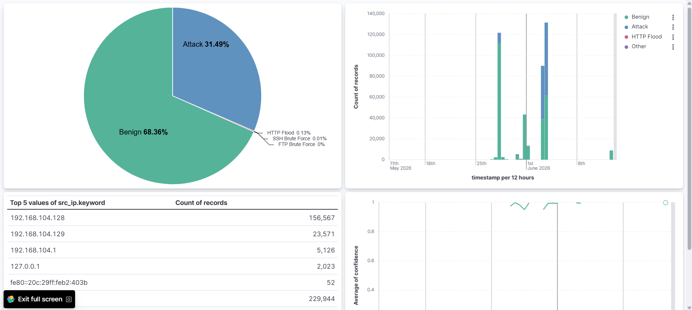
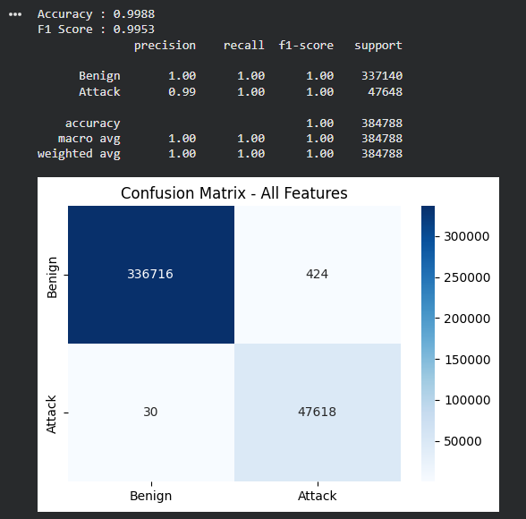
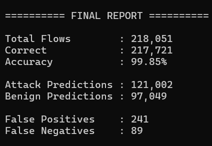

# NeuroSOC-IDS

Machine Learning Powered Security Operations Center (SOC) Platform for Network Intrusion Detection using XGBoost, FastAPI, Elasticsearch, and Kibana.

---

## Overview

NeuroSOC-IDS is an end-to-end Security Operations Center (SOC) simulation platform that combines Machine Learning-based intrusion detection with centralized security monitoring and visualization.

The project uses a trained XGBoost classifier on the CICIDS2017 dataset to classify network traffic as either benign or malicious. Predictions are exposed through a FastAPI inference service and stored in Elasticsearch, while Kibana provides real-time SOC dashboards for visualization and analysis.

The goal of this project is to demonstrate how machine learning can be integrated into a modern SOC workflow, from traffic ingestion and classification to alert storage and security analytics.

---

## Key Features

* XGBoost-based Intrusion Detection System (IDS)
* Trained on CICIDS2017 network traffic dataset
* FastAPI REST API inference server
* Batch prediction support
* Elasticsearch event storage
* Kibana SOC dashboard visualization
* Docker Compose deployment
* Replay engine for CICIDS2017 traffic simulation
* Dashboard export for quick setup
* Reproducible training notebook

---

## Architecture

```text
CICIDS2017 Dataset
        │
        ▼
Replay Engine
(cicids_replay.py)
        │
        ▼
FastAPI Model Server
(XGBoost Inference)
        │
        ▼
Elasticsearch
(Security Event Storage)
        │
        ▼
Kibana
(SOC Dashboard)
```

---

## Dashboard Preview

### Kibana SOC Dashboard



---

## Model Performance

### Accuracy



### Classification Report



---

## Project Structure

```text
NeuroSOC-IDS
│
├── dashboards/
│   └── soc_ids_dashboard.ndjson
│
├── model-server/
│   ├── Dockerfile
│   ├── main.py
│   ├── requirements.txt
│   └── ids_model/
│       ├── feature_cols.pkl
│       ├── label_map.csv
│       └── xgb_model.json
│
├── notebooks/
│   └── NeuroSOC_IDS_Training.ipynb
│
├── replay/
│   └── cicids_replay.py
│
├── screenshots/
│   ├── Accuracy.png
│   ├── Report.png
│   ├── kibana_elasticsearch_dashboard.png
│   └── directory_structure.png
│
├── docker-compose.yml
├── .gitignore
└── README.md
```

---

## Technology Stack

| Component        | Technology    |
| ---------------- | ------------- |
| Machine Learning | XGBoost       |
| API Server       | FastAPI       |
| Data Processing  | Pandas, NumPy |
| Visualization    | Kibana        |
| Search & Storage | Elasticsearch |
| Containerization | Docker        |
| Dataset          | CICIDS2017    |

---

## Model API

### Health Check

```http
GET /health
```

Response:

```json
{
  "status": "healthy"
}
```

---

### Feature List

```http
GET /features
```

Returns the exact feature set expected by the model.

---

### Predict Single Flow

```http
POST /predict
```

Request:

```json
{
  "features": {
    "Flow Duration": 12345,
    "Total Fwd Packets": 10
  }
}
```

Response:

```json
{
  "prediction": "Attack",
  "confidence": 0.982,
  "alert": true
}
```

---

### Batch Prediction

```http
POST /predict/batch
```

Allows high-throughput inference for multiple flows simultaneously.

---

## Quick Start

### Clone Repository

```bash
git clone https://github.com/Cisco-hacker/NeuroSOC-IDS.git

cd NeuroSOC-IDS
```

---

### Start Services

```bash
docker compose up --build -d
```

This launches:

* FastAPI Model Server
* Elasticsearch
* Kibana

---

### Verify Services

Model API:

```text
http://localhost:8000
```

Elasticsearch:

```text
http://localhost:9200
```

Kibana:

```text
http://localhost:5601
```

---

## Import Dashboard

1. Open Kibana
2. Navigate to:

```text
Stack Management → Saved Objects
```

3. Click:

```text
Import
```

4. Select:

```text
dashboards/soc_ids_dashboard.ndjson
```

5. Import the dashboard

---

## Running Traffic Replay

The replay engine simulates network traffic using CICIDS2017 flow records.

```bash
cd replay

python cicids_replay.py
```

The script:

* Loads CICIDS2017 flows
* Sends traffic features to FastAPI
* Receives ML predictions
* Stores alerts in Elasticsearch
* Updates Kibana visualizations

---

## Training Pipeline

The complete training workflow is available in:

```text
notebooks/NeuroSOC_IDS_Training.ipynb
```

The notebook covers:

* Data preprocessing
* Feature engineering
* Class balancing
* Model training
* Hyperparameter tuning
* Evaluation
* Model export

---

## Example Use Cases

* Security Operations Center (SOC) simulation
* Intrusion Detection System research
* Machine Learning cybersecurity projects
* Network anomaly detection experiments
* Security analytics demonstrations
* Blue Team portfolio projects

---

## Future Improvements

* Real-time packet capture support
* Zeek integration
* Suricata integration
* Email alerting
* Threat intelligence enrichment
* MITRE ATT&CK mapping
* Ensemble machine learning models
* Real-time streaming ingestion

---

## Disclaimer

This project is intended for educational, research, and defensive cybersecurity purposes only.

---

## Author

Pranava Prakash J

GitHub:
https://github.com/Cisco-hacker

---

## License

MIT License
